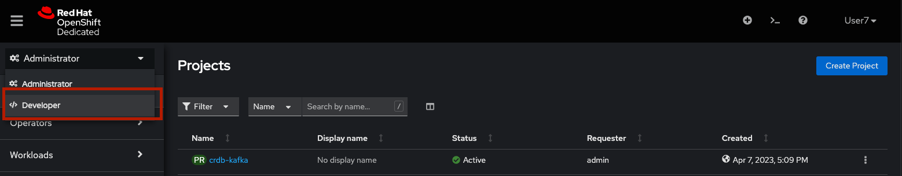

## OpenShift Logins
In the terminal at the right, you will execute many of the command-line
instructions required for this lab. However, you must first log-in to OpenShift
as the correct user.

. Login to OpenShift on the command line
+
[source,bash,role=execute]
----
oc login -u %user% -p %password%
----
+
[NOTE]
The super security-conscious will recognize that entering passwords on the
command line as part of command execution is a bad practice.

. Switch to your project
+
[source,bash,role=execute]
----
oc project %user%-eda
----

. Login to the OpenShift web console
+
Console URL: %openshift_console_url%
+
* Login:
+
[source,role=copy]
----
%user%
----

* Password:
+
[source,role=copy]
----
%password%
----

. Switch to the Developer perspective
+
* In the OpenShift console's left-side menu, select the _Developer_ perspective
from the drop-down menu if it is not already selected.
+

+
* Then, make sure to select the `%user%-eda` from the drop-down menu labeled
_Project_ at the top-left.

## Fruit Shop Application
. Next, you will deploy the Node.js "Fruit" application by importing it from Github.
+
* Select +Add in the left-hand navigation and then click the Import from Git tile.
+
* Enter the following Git Repo URL in the text box:
+
[source,role=copy]
----
https://github.com/RHODA-lab/fruit-app-nodejs-rhsummit/
----
+
*  Scroll down to the text that says Click on the names to access advanced options and click the word Deployment
*  Add an environment variable called: 
+
[source,role=copy]
----
USERID
----
+
*  with the value:
+
[source,role=copy]
----
%user%
----
+
*  Accept all of the other defaults and click the blue _Create_ button at the
bottom.
* You will return to the _Topology_ view and see that the pod comes up. 
Click the _View Logs_ under the _Pods_ section.
+
You will see an error message that the env variable _SERVICE_BINDING_ROOT_ is missing.
This is to be expected because the Node.js application expects a Service Binding to extract 
the connection details to the database. So let us add the CockroachDB database instance and 
create a Service Binding to it.

## CockroachDB Cloud Hosted Database
. Next, you will add a CockroachDB Cloud Hosted Database
+
* On the OpenShift console's left-side menu, select _+Add_ and then click the _Cloud-Hosted
Database_ tile. 
+
* Select _CockroachDB Cloud_ tile and then click the blue _Add to Topology_ button.
+
* Select the Provider Account called crdb-workshop-provider from the dropdown box
+
* From the list of available database instances select ‘cockroach-db-fruit’
+
* Click the blue _Add to Topology_ button.
+
* Click the blue _Continue_ button.

. Create a service binding between the Node.js Fruit Shop application and
the database instance.
* Hover your mouse over the center of the blue pod ring. You will notice that a
small arrow appears coming out from the ring after a moment.
* Click and drag the arrow to the dotted-line box around the database.
* Click the blue _Create_ button to accept the default service binding name.
[NOTE]
====
A service binding in OpenShift automatically causes a Kubernetes `Secret` to be
injected into the pod. In your case, it is injecting a secret with the details
of the database connection. If you want to see the low-level implementation of
this behavior:

* In the _Topology_ view, click on the pod ring for the Node.js app
* In the right-hand tab, click on the pod, which will have a name like `cockroach-kafka-eda-fruit-node-664b79b5d6-hv8jx`
* In the pod details screen, click on the _YAML_ tab
* Scroll down to the `volumeMounts` section, which will look something like:
+
[source,yaml]
----
volumeMounts:
  - name: cockroach-kafka-eda-fruit-node-d-user12-db-5a60b62d6c-dbsc
    mountPath: /bindings/cockroach-kafka-eda-fruit-node-d-user12-db-5a60b62d6c-dbsc
  - name: kube-api-access-p4pkx
    readOnly: true
    mountPath: /var/run/secrets/kubernetes.io/serviceaccount
----

The Node.js application knows how to extract the relevant connection details from
this mounted secret.
====

After creating the service binding, the pod will restart and get to a _running_ state 
indicated by the blue ring. The pod log will be free of any Service Binding error.

## Testing
. Test the Fruit Shop application
* Open Application UI by clicking the route opener
* Perform basic tasks like inserts/updates within the application UI. For
  example, add 2 Strawberries.
. Obtain credentials to connect to CockroachDB Serverless cluster from Service
binding
* On the Topology page click on the Service Binding arrow:
* In the new right-hand panel, click on the link for the Secret:
* From the Service Binding Secret page, click the _Reveal values_ link
* Observe the values for various connection string parameters, but you will use
a little bash scriptlet to do the hard work for you.
* The `cockroach` CLI is embedded in the terminal. The following bash script will use `jq` to extract details from the secret, and then build the connection string:
+
[source,bash,role=execute]
----
cat ~/assets/test-service-binding.sh
----

* Execute the scriptlet using the following command, and note that it prints out the password you will need to type or copy/paste into the CLI:
+
[source,bash,role=execute]
----
bash ~/assets/test-service-binding.sh
----

* You will see output like the following:
+
[source]
----
Use this password: AmR6x~3C(Cd/
#
# Welcome to the CockroachDB SQL shell.
# All statements must be terminated by a semicolon.
# To exit, type: \q.
#
Connecting to server "free-tier14.aws-us-east-1.cockroachlabs.cloud:26257" as user "user1_eda.user1_db_a8375c8343".
Enter password:
----

* Validate the data was stored in the Database using basic SQL commands:
+
[source,sql,role=execute]
----
select * from %user%.fruit limit 5;
----

* Exit the CockroachDB CLI:
+
[source,role=execute]
----
quit
----
